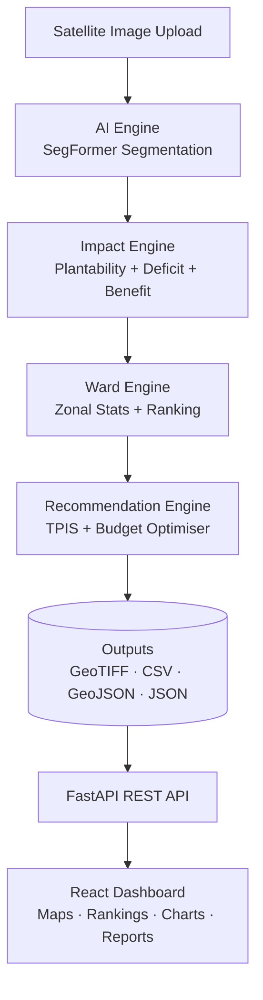

# 🌳 CanopyAI

### AI-Powered Urban Tree Canopy Analysis & Plantation Planning for Delhi

CanopyAI is an end-to-end system that looks at a city from satellite imagery, uses deep learning to map where the trees are (and aren't), scores every municipal ward for how urgently it needs greening, and produces a data-driven, budget-aware tree-plantation plan — all visualised on an interactive GIS dashboard.

> **One-line pitch:** *"Upload a satellite image → get an AI canopy map, ward-by-ward priority ranking, and an optimised tree-plantation plan with cost, CO₂, and cooling estimates."*

---

## 📑 Table of Contents
1. [The Problem](#-the-problem)
2. [Our Solution](#-our-solution)
3. [Key Features](#-key-features)
4. [How It Works — The 4-Stage Pipeline](#-how-it-works--the-4-stage-pipeline)
5. [System Architecture](#-system-architecture)
6. [The AI Model & Results](#-the-ai-model--results)
7. [Tech Stack](#-tech-stack)
8. [Data Inputs](#-data-inputs)
9. [Outputs Produced](#-outputs-produced)
10. [The Dashboard](#-the-dashboard)
11. [Design System](#-design-system)
12. [How to Run](#-how-to-run)
13. [Project Structure](#-project-structure)
14. [Suggested PPT Flow](#-suggested-ppt-flow-for-the-presentation)
15. [Future Scope](#-future-scope)

---

## 🔴 The Problem

Cities like Delhi face a compounding environmental crisis:

- **Urban Heat Islands** — concrete and built-up areas trap heat, pushing local temperatures several degrees above surrounding areas.
- **Canopy Deficit** — tree cover is unevenly distributed; dense, vulnerable neighbourhoods often have the *least* greenery.
- **Blind spending** — plantation drives are often done without data, so money and effort don't go where impact is highest.

Planners lack a fast, objective way to answer: **"Where exactly should we plant trees, how many, and what will it achieve?"**

---

## 🟢 Our Solution

CanopyAI answers that question automatically. It combines:

- **Computer Vision** — a deep-learning segmentation model that classifies every pixel of a satellite image into land-cover types (canopy, built-up, cropland, bare).
- **Geospatial Analysis** — overlays the canopy map with vegetation, temperature, population and vulnerability data, aggregated to **250 Delhi municipal wards**.
- **Decision Science** — a scoring + optimisation layer that ranks wards by need and allocates trees within a budget, estimating cost, carbon capture and cooling benefit.
- **Interactive Visualisation** — a web dashboard with live GIS maps, rankings, charts and downloadable reports.

---

## ⭐ Key Features

| Feature | Description |
|---|---|
| 🛰️ **AI Canopy Mapping** | Pixel-level land-cover segmentation from satellite imagery |
| 🗺️ **Interactive GIS Map** | Leaflet-based map with ward boundaries, canopy overlays & priority colours |
| 📊 **Ward Priority Ranking** | All 250 wards scored & ranked by tree-planting urgency |
| 🌡️ **Impact Scoring** | Combines canopy deficit, heat, vegetation & vulnerability into one index |
| 💰 **Budget Optimisation** | Allocates trees per ward under a cost constraint for maximum impact |
| 📈 **Benefit Estimation** | Projects trees needed, cost (₹), CO₂ captured & temperature reduction |
| 📄 **Reports & Downloads** | Exportable GeoTIFFs, CSVs, GeoJSON & PDF summaries |

---

## ⚙️ How It Works — The 4-Stage Pipeline

When a user uploads a satellite image and clicks **Predict**, the backend runs four engines in sequence:

### 1️⃣ AI Engine — *"What's on the ground?"*
Loads the trained **SegFormer** model, tiles the large satellite raster into patches, runs inference on each, and stitches the results back into a full **canopy/land-cover map** exported as a GeoTIFF.
`backend/ai_engine/` → `loader → tiler → predictor → stitcher → exporter`

### 2️⃣ Impact Engine — *"Where is the need greatest?"*
Aligns the canopy map with supporting layers (NDVI, land-surface temperature, vulnerability) and computes:
- **Plantability** (where trees *can* go)
- **Canopy deficit** (where cover is missing)
- **Benefit** and a combined **Impact Score** per area.
`backend/impact_engine/`

### 3️⃣ Ward Engine — *"Roll it up to decision units."*
Uses **zonal statistics** to aggregate pixel-level scores to each of the **250 municipal wards**, then ranks them.
`backend/ward_engine/` → `zonal_stats → ranking → exporter`

### 4️⃣ Recommendation Engine — *"What's the plan?"*
Computes the **Tree Planting Impact Score (TPIS)** per ward, then allocates trees under a budget and estimates outcomes:
- Trees needed · Cost (₹) · CO₂ absorbed (10-yr) · Temperature reduction
- Models for **carbon**, **cooling**, **water feasibility** and a **budget optimiser**.
`backend/recommendation_engine/`

---

## 🏗 System Architecture



**Data flow:** Satellite raster → AI segmentation → geospatial scoring → ward aggregation → optimised recommendations → served via REST API → visualised in the browser.

---

## 🧠 The AI Model & Results

- **Model:** SegFormer (transformer-based semantic segmentation) — `CanopySegFormer`
- **Task:** 4-class land-cover segmentation
- **Classes:** `Bare / Other` · `Canopy` · `Built-up` · `Cropland`
- **Checkpoint:** `checkpoints/best_model.pth`
- **Inference:** GPU-accelerated (CUDA) with CPU fallback; tiled + batched for large images

### 📏 Model Performance

| Metric | Score |
|---|---|
| **Accuracy** | **88.71%** |
| **Precision** | 87.33% |
| **Recall** | 87.04% |
| **F1 Score** | 0.8717 |
| **Mean IoU** | 0.7772 |

**Per-class IoU:** Bare 0.815 · Canopy 0.626 · Built-up 0.841 · Cropland 0.827

### 🌍 Sample Land-Cover Breakdown (analysed region)

| Class | Coverage |
|---|---|
| Bare / Other | 53.26% |
| Built-up | 21.21% |
| Cropland | 16.76% |
| **Canopy** | **8.77%** ⚠️ |

> The low **8.77% canopy cover** is exactly the gap CanopyAI helps close.

### 📊 Ward Analysis (sample run)
- **Wards analysed:** 250
- **Highest priority score:** 88.52 · **Average:** 58.27
- **Top-ranked ward:** *Bazar Sita Ram*

---

## 🛠 Tech Stack

**AI / Backend**
- Python 3.11 · **PyTorch** (SegFormer) · **FastAPI** (REST API)
- **Rasterio / GeoPandas** (geospatial) · NumPy · Pandas
- Uvicorn (ASGI server)

**Frontend**
- **React 19** + **Vite 8** · **Tailwind CSS 4**
- **Leaflet** + `georaster-layer-for-leaflet` (GIS maps)
- **Recharts** (data viz) · Framer Motion · Axios · jsPDF · Lucide/Material Symbols icons

---

## 🗂 Data Inputs

CanopyAI fuses multiple geospatial layers (Delhi MCD region):

| Layer | Purpose |
|---|---|
| 13-band satellite imagery | Model input for segmentation |
| **NDVI** (vegetation index) | Greenness / vegetation health |
| **LST** (land-surface temperature) | Heat-island detection |
| Rainfall | Water availability context |
| WorldCover (4-class) | Land-cover reference |
| Vulnerability score | Social/urban vulnerability weighting |
| MCD ward boundaries (GeoJSON) | 250 wards for aggregation |

### Key Model Assumptions (`backend/config.py`)
- Cost per tree: **₹200**
- CO₂ absorbed per tree (10 yrs): **25 kg**
- Temperature reduction: **0.10 °C per 1,000 trees**
- Max trees for highest-priority ward: **20,000**

**Scoring weights (TPIS):** Low canopy 30% · High temperature 25% · Vegetation deficit 20% · Urban vulnerability 15% · Water score 10%

---

## 📦 Outputs Produced

Each pipeline run writes to `outputs/`:

- **Rasters (GeoTIFF):** `canopy_prediction.tif`, `canopy_deficit.tif`, `plantability.tif`, `impact_score.tif`, `benefit.tif`
- **Ward data:** `ward_rankings.geojson`, `ward_rankings.csv`, `top25_wards.csv`
- **Recommendations:** `final_recommendations.csv`, `optimized_plan.csv`, `top10_recommendations.json`
- **Reports:** `evaluation_report.txt`, `area_statistics.txt`, `summary_report.json`
- **Visuals:** `prediction_colored.png`, `comparison.png`

---

## 🖥 The Dashboard

A single-page React app with 9 sections (routes in `frontend/src/App.jsx`):

| Page | What it shows |
|---|---|
| **Dashboard** | KPI cards, map preview, AI summary, analytics charts |
| **Upload** | Satellite image upload → triggers the pipeline |
| **Analysis** | Pipeline status & land-cover breakdown |
| **Map Viewer** | Full interactive GIS map with ward + prediction layers |
| **Ranking** | Ward priority ranking table & cards |
| **Recommendations** | Per-ward tree plans (trees, cost, CO₂, priority) |
| **Reports** | Model metrics, accuracy, charts, PDF export |
| **Downloads** | Download all generated outputs |
| **Settings** | App configuration |

---

## 🎨 Design System

CanopyAI uses a clean **light, nature-inspired theme** with a centralised token system (`frontend/src/styles/globals.css`):

- **Brand greens:** `#002d1c` / `#07472e` (primary), `#1b4332` / `#3e6752` (secondary)
- **Surfaces:** `#fcf9f8` background, `#ffffff` cards
- **Priority / risk scale:** Very High `#ba1a1a` → High `#f48c24` → Medium `#eab552` → Low `#7fa38f` → Very Low `#3e6752`
- **Typography:** system sans-serif stack + Google **Material Symbols** icons

---

## 🚀 How to Run

### Prerequisites
- Python 3.11 + virtualenv · Node.js 18+ · (GPU optional, CPU works)
- The trained checkpoint at `checkpoints/best_model.pth`

### Backend (FastAPI)
```bash
# from project root
pip install -r requirements.txt
uvicorn backend.api.main:app --reload
# API runs at http://localhost:8000  (docs at /docs)
```

### Frontend (React + Vite)
```bash
cd frontend
npm install
npm run dev
# app runs at http://localhost:5173
```

### Key API Endpoints
`POST /upload` · `POST /predict` · `GET /dashboard` · `GET /statistics` · `GET /recommendations` · `GET /ward-rankings` · `GET /pipeline-status` · `GET /health`

---

## 📁 Project Structure

```
CanopyAI/
├── backend/
│   ├── ai_engine/              # SegFormer inference pipeline
│   ├── impact_engine/          # Plantability, deficit, benefit, impact score
│   ├── ward_engine/            # Zonal stats + ward ranking
│   ├── recommendation_engine/  # TPIS, budget optimiser, carbon/cooling models
│   ├── api/                    # FastAPI routes, services, schemas
│   └── config.py               # Cost/CO₂/weights configuration
├── frontend/                   # React + Vite dashboard
│   └── src/{pages,components,services,styles}
├── src/models/segformer.py     # Model architecture
├── checkpoints/                # Trained weights
├── data/                       # Input rasters & ward boundaries
└── outputs/                    # Generated maps, CSVs, reports
```

---

## 🎤 Suggested PPT Flow (for the presentation)

A ready-made slide order — one section ≈ one slide:

1. **Title** — CanopyAI + one-line pitch + team names
2. **The Problem** — urban heat, canopy deficit, blind plantation spending (use the *53% bare vs 8.77% canopy* stat)
3. **Our Solution** — the one-line flow diagram
4. **Live Demo / Screenshots** — dashboard, GIS map, ranking page
5. **How It Works** — the 4-stage pipeline (use the architecture diagram)
6. **The AI Model** — SegFormer + the 4 classes + a before/after prediction image (`comparison.png`)
7. **Results** — the metrics table (**88.71% accuracy**, F1 0.87, mIoU 0.78)
8. **Ward Ranking & Recommendations** — top wards, TPIS scoring, cost/CO₂/cooling estimates
9. **Tech Stack** — logos: PyTorch, FastAPI, React, Leaflet
10. **Impact & Future Scope** — scalability to other cities, real-time monitoring
11. **Thank You / Q&A**

**💡 Talking-point highlights for slides:**
- *"88.71% pixel accuracy"* — headline number.
- *"Only 8.77% canopy cover"* — the shocking stat that frames the problem.
- *"250 wards ranked automatically"* — scale.
- *"₹, CO₂ and °C estimates per ward"* — turns AI into actionable, budgeted decisions.
- *"Upload → Predict → Plan in one click"* — the demo wow-factor.

**📷 Best visuals to drop into slides** (from `outputs/`):
- `prediction_colored.png` / `full_segmentation_visualization.png` — the AI canopy map
- `comparison.png` — satellite vs. prediction side-by-side
- Dashboard & Map Viewer screenshots from the running app

---

## 🔮 Future Scope
- Real-time canopy monitoring with periodic satellite passes
- Extend beyond Delhi to any city with ward boundaries
- Species recommendation & survival modelling
- Integration with municipal GIS & budgeting systems
- Mobile app for on-ground plantation tracking

---

## 👥 Team
*ASEP Group 4 — CanopyAI*
Add team member names, roles, and guide/mentor here.

---

<div align="center">

**CanopyAI** — *Turning satellite pixels into greener, cooler cities.* 🌳

</div>
